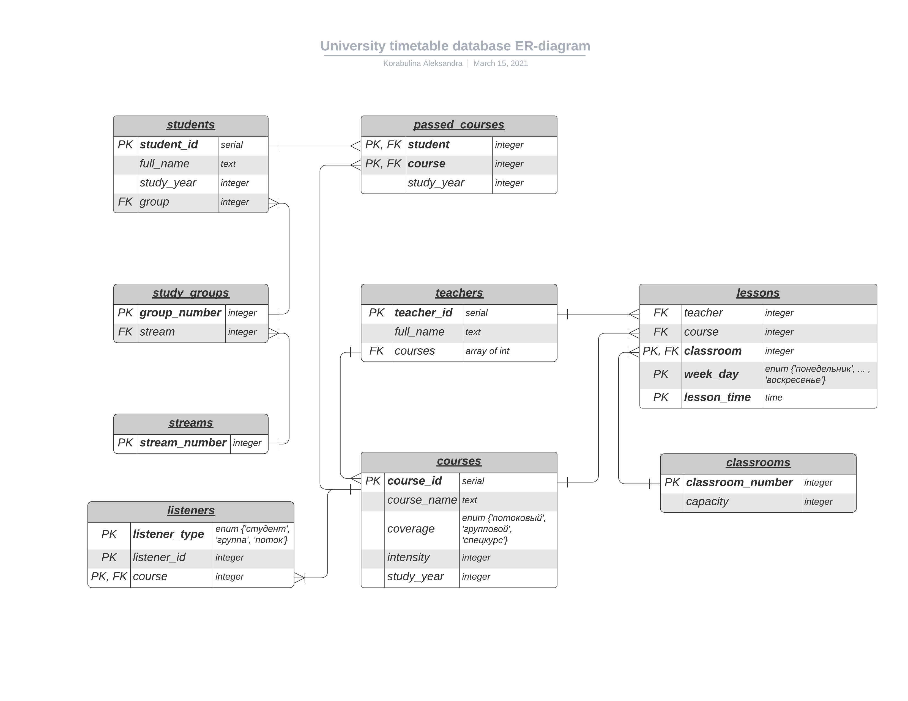
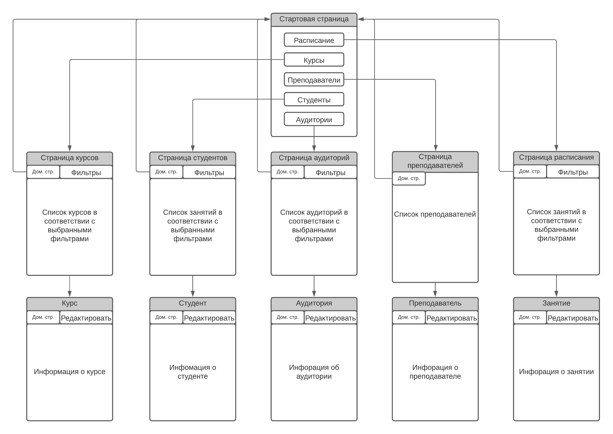

# Схема базы данных

# Описание набора страниц, навигации между ними и их содержимого

1. **Домашняя страница**
    * Кнопка "Расписание" -> **Страница расписания**
    * Кнопка "Курсы" -> **Страница курсов**
    * Кнопка "Преподаватели" -> **Страница преподавателей**
    * Кнопка "Студенты" -> **Страница студентов**
    * Кнопка "Аудитории" -> **Страница аудиторий**
    
2. **Страница расписания**
    * Кнопка "Домашняя страница" -> **Домашняя страница**
    * Зона фильтров: 
        * Выпадающий список преподавателей
        * Выпадающий список студентов
        * Выпадающий список аудиторий
        * Выпадающий список дней недели
        * Кнопка "Применить" -> Обновление списка занятий
    * Зона списка:
        Список занятий в соответствии с фильтрами (в виде таблицы).
        Столбцы таблицы:
        * № (в списке) -> **Описание занятия**
        * День недели
        * Время
        * Курс
        * Преподаватель
        * Аудитория
    * Кнопка "Добавить" -> **Страница добавления** с полями для ввода времени и выпадающих списков для выбора курса, аудитории и дня недели занятия (под списком) и кнопки "Применить" -> **Страница расписания**

3. **Страница курсов**
    * Кнопка "Домашняя страница" -> **Домашняя страница**
    * Зона фильтров: 
        * Выпадающий список преподавателей
        * Кнопка "Применить" -> Обновление списка курсов
    * Зона списка:
        Список курсов в соответствии с фильтрами (в виде таблицы).
        Столбцы таблицы:
        * Курс (название)  -> **Описание курса**
        * Охват
        * Интенсивность
        * Преподаватель
        * Год обучения (если есть)
    * Кнопка "Добавить" -> **Страница добавления** с полями для ввода названия, интенсивности, года обучения и выпадающего списка для выбора охвата и кнопки "Применить" -> **Страница курсов**  (для добавления слушателей необходимо перейти на страницу добавленного курса)

4.  **Страница преподавателей**
    * Кнопка "Домашняя страница" -> **Домашняя страница**
    * Зона списка:
        Список преподавателей в соответствии с фильтрами (в виде таблицы).
        Столбцы таблицы:
        * ФИО -> **Описание преподавателя**
    * Кнопка "Добавить" -> **Страница добавления** с полем для ввода ФИО преподавателя (под списком) и кнопки "Применить" -> **Страница преподавателей**

5.  **Страница студентов**
    * Кнопка "Домашняя страница" -> **Домашняя страница**
    * Зона фильтров: 
        * Поле для ввода номера группы
        * Поле для ввода номера потока
        * Поле для ввода года обучения
        * Кнопка "Применить" -> Обновление списка студентов
    * Зона списка:
        Список студентов в соответствии с фильтрами (в виде таблицы).
        Столбцы таблицы:
        * ФИО -> **Описание студента**
        * Год обучения
        * Группа
        * Поток 
    * Кнопка "Добавить" -> **Страница добавления** с полями для ввода ФИО, года обучения и группы студента (под списком) и кнопки "Применить" -> **Страница студентов**

6.  **Страница аудиторий**
    * Кнопка "Домашняя страница" -> **Домашняя страница**
    * Зона фильтров: 
        * Поле для введения минимальной вместимости
        * Поле для введения максимальной вместимости
        * Кнопка "Применить" -> Обновление списка аудиторий
    * Зона списка:
        Список аудиторий в соответствии с фильтрами (в виде таблицы).
        Столбцы таблицы:
        * Номер -> **Описание аудитории**
        * Вместимость
    * Кнопка "Добавить" -> **Страница добавления** для ввода номера и вместимости аудитории (под списком) и кнопки "Применить" -> **Страница аудиторий**
    
7. **Описание занятия**
    * Кнопка "Домашняя страница" -> **Домашняя страница**
    * Кнопка "Редактировать" - день недели, время и аудитория занятия становятся доступны для редактирования
    * Зона описания:
        * Преподаватель
        * Курс
        * Аудитория
        * День недели
        * Время
    * Кнопка "Применить" - обновление атрибутов занятия в соответствии с внесенными изменениями (видна только после нажатия кнопки "Редактировать")
    * Кнопка "Удалить" - удаление соответствующего занятия и -> **Страница занятий**
    
8. **Описание курса**
    * Кнопка "Домашняя страница" -> **Домашняя страница**
    * Кнопка "Редактировать" - название, охват, список слушателей, интенсивность, год обучения курса становятся доступны для редактирования
    * Зона описания:
        * Название курса
        * Охват
        * Список слушателей
        * Преподаватель
        * Интенсивность
        * Год обучения
    * Кнопка "Применить" - обновление атрибутов курса в соответствии с внесенными изменениями (видна только после нажатия кнопки "Редактировать")
    * Кнопка "Удалить" - удаление соответствующего курса и -> **Страница курсов**
    В режиме редактирования рядом с каждым элементом списка слушателей  можно поставить или убрать галочку, тем самым добавив или убрав студента из списка.
        
9. **Описание преподавателя**
    * Кнопка "Домашняя страница" -> **Домашняя страница**
    * Кнопка "Редактировать" - все артибуты преподавателя становятся доступны для редактирования
    * Зона описания:
        * ФИО
        * Список курсов
    * Кнопка "Применить" - обновление атрибутов преподавателя в соответствии с внесенными изменениями (видна только после нажатия кнопки "Редактировать")
    * Кнопка "Удалить" - удаление соответствующего преподавателя и -> **Страница преподавателей**
    В режиме редактирования рядом с каждым элементом списка курсов появляется кнопка "Удалить" (по нажатию курс пропадает из списка), а внизу списка появляется выпадающий список курсов, при нажатии на элемент которого, курс добавляется в список курсов преподавателя.
    
10. **Описание студента**
    * Кнопка "Домашняя страница" -> **Домашняя страница**
    * Кнопка "Редактировать" - все артибуты занятия становятся доступны для редактирования
    * Зона описания:
        * ФИО
        * Группа
        * Поток
        * Год обучения
        * Список пройденных курсов + год обучения, на котором курс пройден
    * Кнопка "Применить" - обновление атрибутов студента в соответствии с внесенными изменениями (видна только после нажатия кнопки "Редактировать")
    * Кнопка "Удалить" - удаление соответствующего студента и -> **Страница студентов**
    В режиме редактирования рядом с каждым элементом списка курсов появляется кнопка "Удалить" (по нажатию курс пропадает из списка), а внизу списка появляется выпадающий список курсов, поле для ввода года обучения и кнопка "Добавить", при нажатии на которую курс добавляется в список курсов студента.
                
11. **Описание аудитории**
    * Кнопка "Домашняя страница" -> **Домашняя страница**
    * Кнопка "Редактировать" - все артибуты занятия становятся доступны для редактирования
    * Зона описания:
        * Номер
        * Вместимость
    * Кнопка "Применить" - обновление атрибутов аудитории в соответствии с внесенными изменениями (видна только после нажатия кнопки "Редактировать")
    * Кнопка "Удалить" - удаление соответствующей аудитории и -> **Страница аудиторий**

12. **Страница добавления**
    * Поля для ввода / выпадающие списки в зависимости от страницы, с которой был совершен переход
    * Кнопка "Добавить" -> соответствующая страница (та, с которой перешли на страницу добавления)
    
# Описание сценариев использования
1. Получение списка студентов, в том числе по потокам, группам, годам обучения:
    **Домашняя страница** -- "Студенты" -> **Страница студентов** -- Выбор соответствующих фильтров -- "Применить"
    
2. Получение списка преподавателей, в том числе по проводимым курсам:
    **Домашняя страница** -- "Преподаватели" -> **Страница преподавателей** -- Выбор соответствующих фильтров -- "Применить"
    
3. Получение списка аудиторий, в том числе по вместимости:
    **Домашняя страница** -- "Аудитории" -> **Страница аудиторий** -- Выбор соответствующих фильтров -- "Применить"
    
4. Получение расписания на заданный день для студента, преподавателя или аудитории:
    **Домашняя страница** -- "Расписание" -> **Страница занятий** -- Выбор соответствующих фильтров -- "Применить"
    
5. Получение списка курсов, в том числе по преподавателям, проводящим курсы:
    **Домашняя страница** -- "Курсы" -> **Страница курсов** -- Выбор соответствующих фильтров -- "Применить"
    
6. Добавление нового занятия, курса, студента, преподавателя или аудитории:
    **Домашняя страница** -- "Занятия/Курсы/Студенты/Преподаватели/Аудитории" -> **Страница занятий/курсов/студентов/преподавателей/аудиторий** -- "Добавить" -> **Страница добавления** -- ввод соответствующих данных -- "Применить"
    
7. Просмотр информации о занятии, курсе, студенте, преподавателе или аудитории:
    **Домашняя страница** -- "Занятия/Курсы/Студенты/Преподаватели/Аудитории" -> **Страница занятий/курсов/студентов/преподавателей/аудиторий** -- поиск нужной строки в списке -- нажатие на поле в первом столбце нужной строки -> **Описание занятия/курса/студента/преподавателя/аудитории**
    
8. Удаление занятия, курса, студента, преподавателя или аудитории:
    **Домашняя страница** -- "Занятия/Курсы/Студенты/Преподаватели/Аудитории" -> **Страница занятий/курсов/студентов/преподавателей/аудиторий** -- поиск нужной строки в списке -- нажатие на поле в первом столбце нужной строки -> **Описание занятия/курса/студента/преподавателя/аудитории** -- "Удалить"
    
9. Редактирование информации (кроме списка пройденных курсов для студентов и списка проводимых курсов для преподавателей) о занятии, курсе, студенте, преподавателе или аудитории:
    **Домашняя страница** -- "Занятия/Курсы/Студенты/Преподаватели/Аудитории" -> **Страница занятий/курсов/студентов/преподавателей/аудиторий** -- поиск нужной строки в списке -- нажатие на поле в первом столбце нужной строки -> **Описание занятия/курса/студента/преподавателя/аудитории** -- "Редактировать" -- Изменение необходимых данных -- "Применить"

10. Добавление нового спецкурса для студента:
    **Домашняя страница** -- "Студенты" -> **Страница студентов** -- поиск нужной строки в списке -- нажатие на поле в первом столбце нужной строки -> **Описание студента** -- "Редактировать" -- выбор спецкурса из выпадающего списка -- ввод года обучения в поле для ввода -- "Добавить" -- "Применить"
    
11. Удаление спецкурса для студента:
    **Домашняя страница** -- "Студенты" -> **Страница студентов** -- поиск нужной строки в списке -- нажатие на поле в первом столбце нужной строки -> **Описание студента** -- "Редактировать" -- поиск спецкурса в списке -- "Удалить" -- "Применить"
    
12. Добавление нового проводимого курса для преподавателя:
    **Домашняя страница** -- "Преподаватели" -> **Страница преподавателей** -- поиск нужной строки в списке -- нажатие на поле в первом столбце нужной строки -> **Описание преподавателя** -- "Редактировать" -- выбор курса из выпадающего списка -- "Применить"
    
13. Удаление проводимого курса для преподавателя:
    **Домашняя страница** -- "Преподаватели" -> **Страница преподавателей** -- поиск нужной строки в списке -- нажатие на поле в первом столбце нужной строки -> **Описание преподавателя** -- "Редактировать" -- поиск курса в списке -- "Удалить" -- "Применить"
    
14. Добавление и удаление студентов из списка слушателей спецкурса:
        **Домашняя страница** -- "Курсы" -> **Страница курсов** -- поиск нужной строки в списке -- нажатие на поле в первом столбце нужной строки -> **Описание курса** -- "Редактировать" -- поиск студента в списке -- поставить или убрать галочку -- "Применить"
