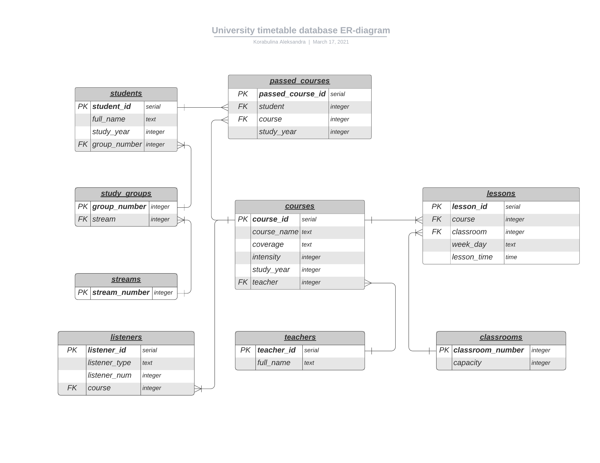

# Схема базы данных

# Описание набора страниц, навигации между ними и их содержимого

1. **Домашняя страница**
    * Кнопка "Расписание" -> **Страница расписания**
    * Кнопка "Курсы" -> **Страница курсов**
    * Кнопка "Преподаватели" -> **Страница преподавателей**
    * Кнопка "Студенты" -> **Страница студентов**
    * Кнопка "Аудитории" -> **Страница аудиторий**
    
2. **Страница расписания**
    * Кнопка "Домашняя страница" -> **Домашняя страница**
    * Зона фильтров: 
        * Выпадающий список преподавателей
        * Выпадающий список студентов
        * Выпадающий список аудиторий
        * Выпадающий список дней недели
        * Кнопка "Применить" -> Обновление списка занятий
    * Зона списка:
        Список занятий в соответствии с фильтрами (в виде таблицы).
        Столбцы таблицы:
        * Время
        * День недели
        * Курс
        * Аудитория
        * Преподаватель
    * Кнопка "Добавить" -> **Страница добавления** с полями для ввода времени и выпадающих списков для выбора курса, аудитории и дня недели занятия и кнопки "Применить" -> **Страница расписания** или **Страница ошибки**

3. **Страница курсов**
    * Кнопка "Домашняя страница" -> **Домашняя страница**
    * Зона фильтров: 
        * Выпадающий список преподавателей
        * Кнопка "Применить" -> Обновление списка курсов
    * Зона списка:
        Список курсов в соответствии с фильтрами (в виде таблицы).
        Столбцы таблицы:
        * Курс (название)  -> **Описание курса**
        * Охват
        * Интенсивность
        * Преподаватель
        * Год обучения (если есть)
    * Кнопка "Добавить" -> **Страница добавления** с полями для ввода названия, интенсивности, года обучения и выпадающего списка для выбора охвата и кнопки "Применить" -> **Страница курсов** или **Страница ошибки** (для добавления слушателей необходимо перейти на страницу добавленного курса)

4.  **Страница преподавателей**
    * Кнопка "Домашняя страница" -> **Домашняя страница**
    * Зона списка:
        Список преподавателей в соответствии с фильтрами (в виде таблицы).
        Столбцы таблицы:
        * ФИО -> **Описание преподавателя**
    * Кнопка "Добавить" -> **Страница добавления** с полем для ввода ФИО преподавателя и кнопки "Применить" -> **Страница преподавателей** или **Страница ошибки**

5.  **Страница студентов**
    * Кнопка "Домашняя страница" -> **Домашняя страница**
    * Зона фильтров: 
        * Поле для ввода номера группы
        * Поле для ввода номера потока
        * Поле для ввода года обучения
        * Кнопка "Применить" -> Обновление списка студентов
    * Зона списка:
        Список студентов в соответствии с фильтрами (в виде таблицы).
        Столбцы таблицы:
        * ФИО -> **Описание студента**
        * Год обучения
        * Группа
        * Поток 
    * Кнопка "Добавить" -> **Страница добавления** с полями для ввода ФИО, года обучения и группы студента и кнопки "Применить" -> **Страница студентов** или **Страница ошибки**

6.  **Страница аудиторий**
    * Кнопка "Домашняя страница" -> **Домашняя страница**
    * Зона фильтров: 
        * Поле для введения минимальной вместимости
        * Поле для введения максимальной вместимости
        * Кнопка "Применить" -> Обновление списка аудиторий
    * Зона списка:
        Список аудиторий в соответствии с фильтрами (в виде таблицы).
        Столбцы таблицы:
        * Номер -> **Описание аудитории**
        * Вместимость
    * Кнопка "Добавить" -> **Страница добавления** с полями для ввода номера и вместимости аудитории и кнопки "Применить" -> **Страница аудиторий** или **Страница ошибки**
    
7. **Описание занятия**
    * Кнопка "Домашняя страница" -> **Домашняя страница**
    * Кнопка "Редактировать" -> **Страница редактирования** с полем для ввода времени и выпадающими списками для выбора дня недели, курса и аудитории
    * Зона описания:
        * Преподаватель
        * Курс
        * Аудитория
        * День недели
        * Время
    * Кнопка "Удалить" - удаление соответствующего занятия -> **Страница занятий**
    
8. **Описание курса**
    * Кнопка "Домашняя страница" -> **Домашняя страница**
    * Кнопка "Редактировать" -> **Страница редактирования** с полями для ввода названия, интенсивности, года обучения и выпадающими списками для выбора охвата и преподавателя
    * Зона описания:
        * Название курса
        * Охват
        * Преподаватель
        * Интенсивность
        * Год обучения
    * Список слушателей в виде таблицы, столбцы таблицы:
        * Номер слушателя
        * Действия - кнопка "Удалить" - удаление соответствующего слушателя -> **Описание курса**
    * Кнопка "Удалить" - удаление соответствующего курса и -> **Страница курсов**
    * Кнопка "Добавить слушателя" -> **Страница добавления** с выпадающим списком для выбора слушателя
        
9. **Описание преподавателя**
    * Кнопка "Домашняя страница" -> **Домашняя страница**
    * Кнопка "Редактировать" -> **Страница редактирования** с полем для ввода ФИО
    * Зона описания:
        * ФИО
    * Кнопка "Удалить" - удаление соответствующего преподавателя -> **Страница преподавателей**
    
10. **Описание студента**
    * Кнопка "Домашняя страница" -> **Домашняя страница**
    * Кнопка "Редактировать" -> **Страница редактирования** с полями для ввода ФИО, номера группы и года обучения
    * Зона описания:
        * ФИО
        * Группа
        * Поток
        * Год обучения
    * Список пройденных курсов в виде таблицы, столбцы таблицы:
        * Название курса
        * Год обучения, на котором курс пройден
        * Действия - кнопка "Удалить" - удаление соответствующего курса -> **Описание студента**
    * Кнопка "Удалить" - удаление соответствующего студента и -> **Страница студентов**
    * Кнопка "Добавить курс" -> **Страница добавления** с выпадающим списком для выбора курса и полем для введения года обучения, на котором курс пройден
                
11. **Описание аудитории**
    * Кнопка "Домашняя страница" -> **Домашняя страница**
    * Кнопка "Редактировать" -> **Страница редактирования** с полем для ввода вместимости
    * Зона описания:
        * Номер
        * Вместимость
    * Кнопка "Удалить" - удаление соответствующей аудитории -> **Страница аудиторий**

12. **Страница добавления**
    * Поля для ввода / выпадающие списки в зависимости от страницы, с которой был совершен переход
    * Кнопка "Добавить" -> соответствующая страница (та, с которой перешли на страницу добавления) или **Страница ошибки** (в зависимости от корректности введенных данных)

13. **Страница ошибки**
    * Сообщение об ошибке
    * Кнопка "Назад" -> соответствующая страница (та, с которой перешли на страницу, вызвавшую ошибку)
    
# Описание сценариев использования
1. Получение списка студентов, в том числе по потокам, группам, годам обучения:
    **Домашняя страница** -- "Студенты" -> **Страница студентов** -- Выбор соответствующих фильтров -- "Применить"
    
2. Получение списка преподавателей:
    **Домашняя страница** -- "Преподаватели" -> **Страница преподавателей**
    
3. Получение списка аудиторий, в том числе по вместимости:
    **Домашняя страница** -- "Аудитории" -> **Страница аудиторий** -- Выбор соответствующих фильтров -- "Применить"
    
4. Получение расписания на заданный день для студента, преподавателя или аудитории (или всего сразу):
    **Домашняя страница** -- "Расписание" -> **Страница занятий** -- Выбор соответствующих фильтров -- "Применить"
    
5. Получение списка курсов, в том числе по преподавателям, проводящим курсы:
    **Домашняя страница** -- "Курсы" -> **Страница курсов** -- Выбор соответствующих фильтров -- "Применить"
    
6. Добавление нового занятия, курса, студента, преподавателя или аудитории:
    **Домашняя страница** -- "Расписание/Курсы/Студенты/Преподаватели/Аудитории" -> **Страница расписания/курсов/студентов/преподавателей/аудиторий** -- "Добавить" -> **Страница добавления** -- ввод соответствующих данных -- "Применить"
    
7. Просмотр информации о занятии, курсе, студенте, преподавателе или аудитории:
    **Домашняя страница** -- "Расписание/Курсы/Студенты/Преподаватели/Аудитории" -> **Страница расписания/курсов/студентов/преподавателей/аудиторий** -- поиск нужной строки в списке -- нажатие на поле в первом столбце нужной строки -> **Описание занятия/курса/студента/преподавателя/аудитории**
    
8. Удаление занятия, курса, студента, преподавателя или аудитории:
    **Домашняя страница** -- "Расписание/Курсы/Студенты/Преподаватели/Аудитории" -> **Страница расписания/курсов/студентов/преподавателей/аудиторий** -- поиск нужной строки в списке -- нажатие на поле в первом столбце нужной строки -> **Описание занятия/курса/студента/преподавателя/аудитории** -- "Удалить"
    
9. Редактирование информации (кроме списка пройденных курсов для студентов и списка слушателей для курса) о занятии, курсе, студенте, преподавателе или аудитории:
    **Домашняя страница** -- "Занятия/Курсы/Студенты/Преподаватели/Аудитории" -> **Страница занятий/курсов/студентов/преподавателей/аудиторий** -- поиск нужной строки в списке -- нажатие на поле в первом столбце нужной строки -> **Описание занятия/курса/студента/преподавателя/аудитории** -- "Редактировать" -> **Страница редактирования** -- Изменение необходимых данных -- "Применить"

10. Добавление нового спецкурса для студента:
    **Домашняя страница** -- "Студенты" -> **Страница студентов** -- поиск нужной строки в списке -- нажатие на поле в первом столбце нужной строки -> **Описание студента** -- "Добавить пройденный курс" -> **Страница добавления** -- выбор спецкурса из выпадающего списка -- ввод года обучения в поле для ввода -- "Применить"
    
11. Удаление спецкурса для студента:
    **Домашняя страница** -- "Студенты" -> **Страница студентов** -- поиск нужной строки в списке -- нажатие на поле в первом столбце нужной строки -> **Описание студента** -- поиск спецкурса в списке -- "Удалить"
    
12. Добавление слушателя курса:
        **Домашняя страница** -- "Курсы" -> **Страница курсов** -- "Добавить слушателя" -> **Страница добавления** -- выбор слушателя из списка -- "Применить"

13. Удаление слушателя курса:
    **Домашняя страница** -- "Курсы" -> **Страница курсов** -- поиск нужной строки в списке -- нажатие на поле в первом столбце нужной строки -> **Описание курса** -- поиск слушателя в списке -- "Удалить"
